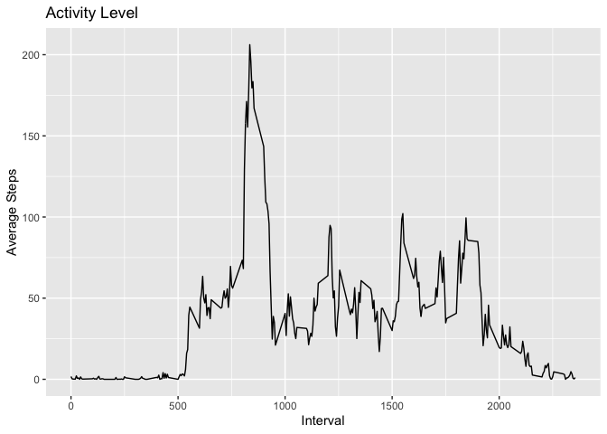
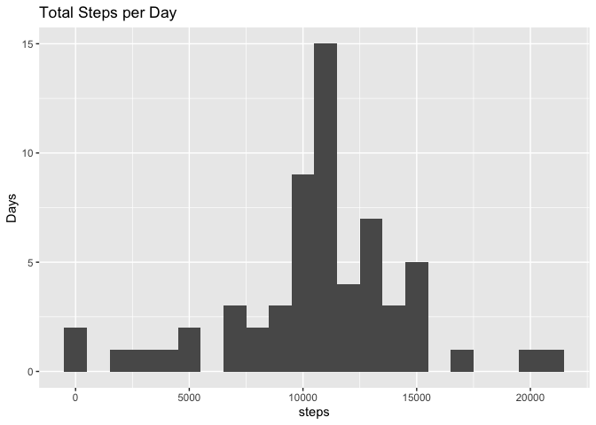

## Loading and preprocessing the data

The data is in a zipped format, so it must be unzipped in order to be read by `read.csv`. No additional processing is necessary at this stage.


```r
activity <- read.csv(unzip("activity.zip"))
```


## What is mean total number of steps taken per day?

Using `tapply`, the total steps for each date in the dataset may be summed. These totals are then plotted using `ggplot2`.


```r
library(ggplot2)
steps <- tapply(activity$steps, activity$date, sum)
mean_steps <- mean(steps, na.rm = TRUE)
median_steps <- median(steps, na.rm = TRUE)
qplot(steps, binwidth = 1000) + ylab("Days") + ggtitle("Total Steps per Day")
```

```
## Warning: Removed 8 rows containing non-finite values (stat_bin).
```

<!-- -->

The mean number of steps is 1.0766189\times 10^{4} steps and the median is 10765 steps.

## What is the average daily activity pattern?
The average activity over the intervals of the day can be estimated by average the number of steps per interval over each day. This is achieved with the `tapply` function.

```r
pattern <- tapply(activity$steps, activity$interval, mean, na.rm = TRUE)
qplot(x = as.numeric(names(pattern)), y = pattern, geom = 'line') + ggtitle("Activity Level") +
    ylab("Average Steps") + xlab("Interval")
```

<!-- -->

```r
max_int <- names(pattern[pattern == max(pattern)])
```

The interval for which the average step count is maximum is 835.

## Imputing missing values

```r
num_na <- sum(is.na(activity$steps))
```

There are 2304 values for steps in the activity dataset. One way to address this is to subsititue the average steps for the interval (calculated previously) for the missing value.


```r
activity_narm <- activity
for (i in seq(1, length(activity$steps))) {
    if (is.na(activity$steps[i])) {
        activity_narm$steps[i] <- pattern[as.character(activity$interval[i])]
    }
}

steps <- tapply(activity_narm$steps, activity_narm$date, sum)
mean_steps <- mean(steps, na.rm = TRUE)
median_steps <- median(steps, na.rm = TRUE)
qplot(steps, binwidth = 1000) + ylab("Days") + ggtitle("Total Steps per Day")
```

<!-- -->

The mean number of steps is 1.0766189\times 10^{4} steps and the median is 1.0766189\times 10^{4} steps.

## Are there differences in activity patterns between weekdays and weekends?
