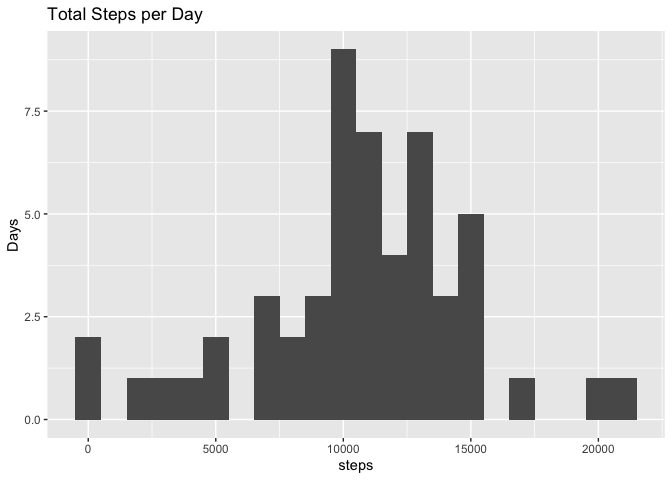

## Loading and preprocessing the data

The data is in a zipped format, so it must be unzipped in order to be read by `read.csv`. No additional processing is necessary at this stage.


```r
activity <- read.csv(unzip("activity.zip"))
```


## What is mean total number of steps taken per day?

Using `tapply`, the total steps for each date in the dataset may be summed. These totals are then plotted using `ggplot2`.


```r
library(ggplot2)
steps <- tapply(activity$steps, activity$date, sum)
mean_steps <- mean(steps, na.rm = TRUE)
median_steps <- median(steps, na.rm = TRUE)
qplot(steps, binwidth = 1000) + ylab("Days") + ggtitle("Total Steps per Day")
```

```
## Warning: Removed 8 rows containing non-finite values (stat_bin).
```

<!-- -->

The mean number of steps is 1.0766189\times 10^{4} steps and the median is 10765 steps.

## What is the average daily activity pattern?


## Imputing missing values


## Are there differences in activity patterns between weekdays and weekends?
